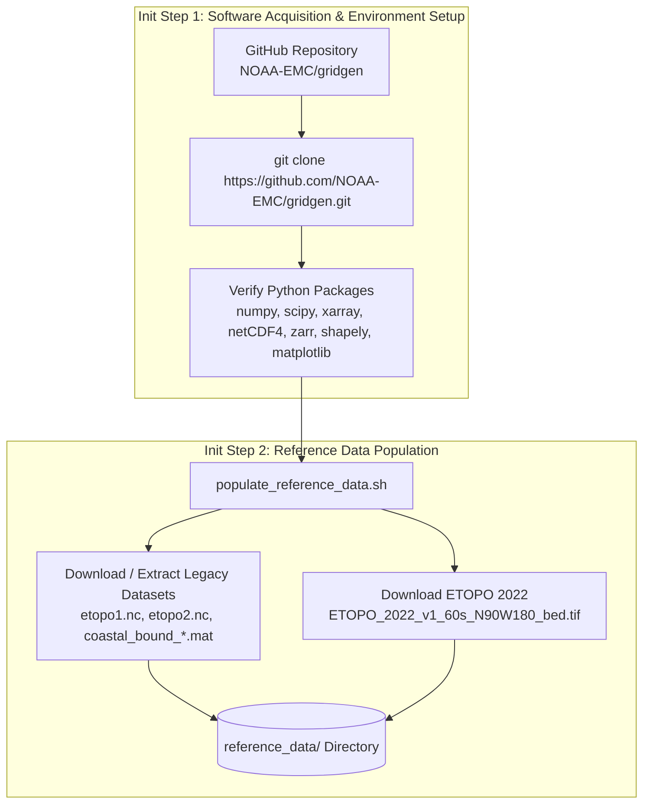
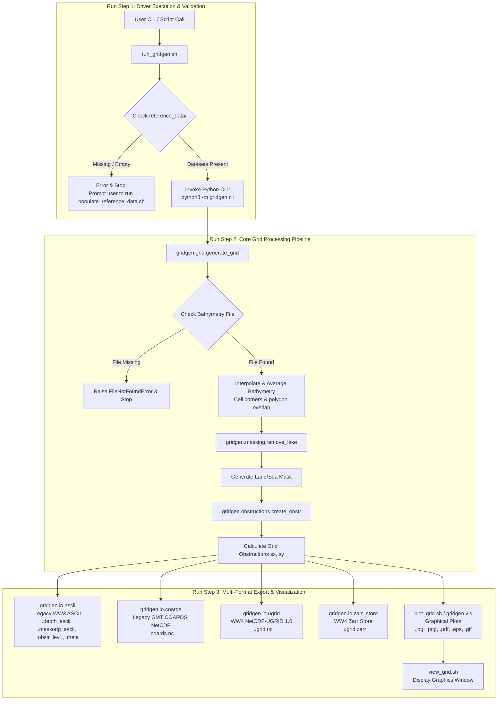

# WAVEWATCH III (WW3) / WAVEWATCH IV (WW4) Gridgen Architecture

This document describes the workflow, data processing steps, and module architecture for the WAVEWATCH III / IV Python Grid Generation Package (`ww4gridgen`).

## Workflow Overview

The grid generation package converts high-resolution source bathymetry and shoreline datasets into structured grid representations used by WAVEWATCH III and WAVEWATCH IV.

### 1. Software & Model Environment Setup

### 2. Tool Execution & Grid Generation Pipeline

## Step-by-Step Processing Pipeline

### Model Setup Stage

- **Init Step 1: Software Acquisition & Environment Verification (`git clone` & Package Check)**
  - Obtain the software package by cloning the repository from GitHub (`https://github.com/NOAA-EMC/gridgen.git`), setting up the Python environment and search path, and verifying required Python dependencies (`numpy`, `scipy`, `xarray`, `netCDF4`, `zarr`, `shapely`, `matplotlib`).

- **Init Step 2: Reference Data Population (`populate_reference_data.sh`)**
  - Populates bathymetry grids (`etopo1.nc`, `etopo2.nc`, or ETOPO 2022) and shoreline boundary MAT files (`coastal_bound_*.mat`) in `reference_data/`.

### Tool Execution Stage

- **Run Step 1: Driver Check & Execution (`run_gridgen.sh` & `gridgen.cli`)**
  - Verifies Python dependency availability (`numpy`, `scipy`, `xarray`, `netCDF4`, `zarr`, `shapely`, `matplotlib`).
  - Ensures `reference_data/` contains bathymetry datasets before invoking `python3 -m gridgen.cli`.

- **Run Step 2: Core Grid Processing Pipeline (`gridgen.grid`, `gridgen.masking`, `gridgen.obstructions`)**
  - **Bathymetry Extraction:** Computes target grid cell corner polygons (`compute_cellcorner`), extracts/averages sub-grid base bathymetry depths or performs bilinear interpolation, and assigns dry values (`999999.0`) to cells above cut-off depth.
  - **Masking & Lake Removal:** Constructs initial binary land/sea mask based on depth values, cleans disconnected water bodies, and applies lake tolerance rules (`remove_lake`).
  - **Sub-grid Obstruction Calculation:** Intersects cell boundary faces with shoreline polygons to produce directional sub-grid obstruction factors `sx` and `sy` (`create_obstr`).

- **Run Step 3: Multi-Format Grid Export (`gridgen.io.*`)**
  - **Legacy WW3 ASCII:** `.depth_ascii`, `.maskorig_ascii`, `.obstr_lev1`, `.meta`
  - **Legacy GMT/NetCDF COARDS:** `_coards.nc`
  - **WW4 NetCDF-UGRID 1.0:** `_ugrid.nc`
  - **WW4 Zarr Store:** `_ugrid.zarr`

- **Run Step 4: Graphical Display & Visualization (`plot_grid.sh` / `gridgen.vis` / `view_grid.sh`)**
  - Generates multi-panel plot graphics displaying bathymetry depth, land-sea masks, and sub-grid directional obstruction factors (`sx`, `sy`) in `jpg`, `png`, `pdf`, `eps`, or `gif` formats, and displays generated graphics in the present window (`view_grid.sh`).
