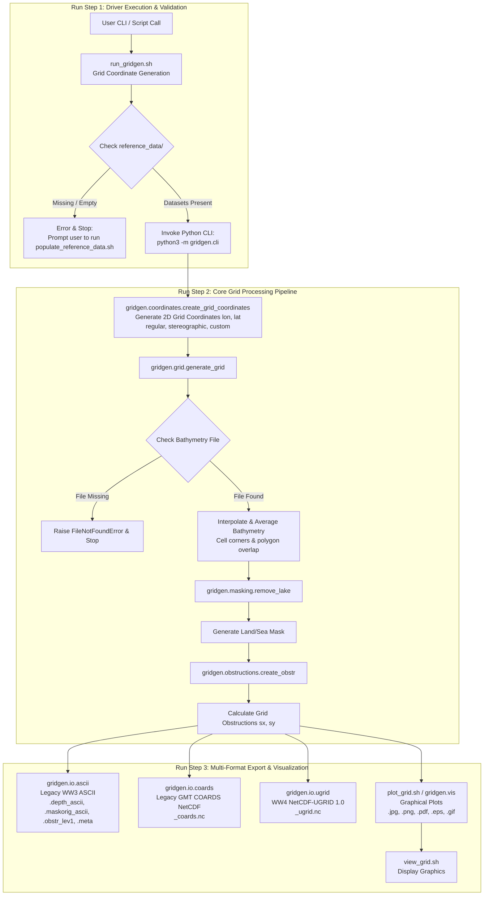

<!--
# WAVEWATCH III (WW3) / WAVEWATCH IV (WW4) Gridgen Architecture
#
# Copyright 2026 National Weather Service (NWS), NOAA. All rights reserved.
# NWS often uses Generative AI (GenAI) for code development and refactoring.
# Whenever GenAI is used, NWS requires a full human review of code before it
# is added to its repositories.
#
# @author Aldgisl (Agentic AI), Hendrik Tolman
# @author Jules (Agentic AI) (contributor)
# @date Initial: 2026-10-02
# @date Latest Update: 2026-10-09
-->

# WAVEWATCH III (WW3) / WAVEWATCH IV (WW4) Gridgen Architecture

This document describes the workflow, data processing steps, and module architecture for the WAVEWATCH III / IV Python Grid Generation Package (`ww4gridgen`).

## Workflow Overview

The grid generation package converts high-resolution source bathymetry and shoreline datasets into structured grid representations used by WAVEWATCH III and WAVEWATCH IV.

### 1. Software & Model Environment Setup

```mermaid
flowchart TD
    subgraph Init Step 1: Software Acquisition & Environment Setup
        A0["GitHub&nbsp;Repository&nbsp;NOAA&#8209;EMC/gridgen"] --> A1["clone&nbsp;https://github.com/NOAA&#8209;EMC/gridgen.git"]
        A1 --> A2["Verify&nbsp;Python&nbsp;Packages<br/>numpy,&nbsp;scipy,&nbsp;xarray,&nbsp;netCDF4,&nbsp;shapely,&nbsp;matplotlib"]
    end

    subgraph Init Step 2: Reference Data Population
        B[populate_reference_data.sh]
        B --> C1[Download / Extract Legacy Datasets<br/>etopo1.nc, etopo2.nc, coastal_bound_*.mat]
        B --> C2[Download ETOPO 2022<br/>ETOPO_2022_v1_60s_N90W180_bed.tif]
        C3[User Alternative / Custom Data Files<br/>Place custom bathymetry or shoreline directly]
        C1 --> D[(reference_data/ Directory)]
        C2 --> D
        C3 --> D
    end

    A2 --> B
```



### 2. Tool Execution & Grid Generation Pipeline



## Step-by-Step Processing Pipeline

### Model Setup Stage

- **Init Step 1: Software Acquisition & Environment Verification (`git clone` & Package Check)**
  - Obtain the software package by cloning the repository from GitHub (`https://github.com/NOAA-EMC/gridgen.git`), setting up the Python environment and search path, and verifying required Python dependencies (`numpy`, `scipy`, `xarray`, `netCDF4`, `shapely`, `matplotlib`).

- **Init Step 2: Reference Data Population (`populate_reference_data.sh` / Direct Placement)**
  - Populates bathymetry grids (`etopo1.nc`, `etopo2.nc`, or ETOPO 2022) and shoreline boundary MAT files (`coastal_bound_*.mat`) in `reference_data/`. Alternatively, users can place their own custom or alternative bathymetry and shoreline datasets directly into the `reference_data/` directory.

### Tool Execution Stage

- **Run Step 1: Driver Check & Execution (`run_gridgen.sh` & `gridgen.cli`)**
  - Verifies Python dependency availability (`numpy`, `scipy`, `xarray`, `netCDF4`, `shapely`, `matplotlib`).
  - Ensures `reference_data/` contains bathymetry datasets before invoking `python3 -m gridgen.cli`, managing execution and grid coordinate generation options (`run_gridgen.sh Grid Coordinate Generation`).

- **Run Step 2: Core Grid Processing Pipeline (`gridgen.coordinates`, `gridgen.grid`, `gridgen.masking`, `gridgen.obstructions`)**
  - **Grid Coordinate Generation:** Creates initial 2D longitude and latitude coordinate arrays (`create_grid_coordinates`) for the specified grid projection/layout (regular lon-lat with optional rotated pole, stereographic in km or arc degrees, or custom grid layout files).
  - **Bathymetry Extraction:** Computes target grid cell corner polygons (`compute_cellcorner`), extracts/averages sub-grid base bathymetry depths or performs bilinear interpolation, and assigns dry values (`999999.0`) to cells above cut-off depth.
  - **Masking & Lake Removal:** Constructs initial binary land/sea mask based on depth values, cleans disconnected water bodies, and applies lake tolerance rules (`remove_lake`).
  - **Sub-grid Obstruction Calculation:** Intersects cell boundary faces with shoreline polygons to produce directional sub-grid obstruction factors `sx` and `sy` (`create_obstr`).

- **Run Step 3: Multi-Format Grid Export (`gridgen.io.*`)**
  - **Legacy WW3 ASCII:** `.depth_ascii`, `.maskorig_ascii`, `.obstr_lev1`, `.meta`
  - **Legacy GMT/NetCDF COARDS:** `_coards.nc`
  - **WW4 NetCDF-UGRID 1.0:** `_ugrid.nc`

- **Run Step 4: Graphical Display & Visualization (`plot_grid.sh` / `gridgen.vis` / `view_grid.sh`)**
  - Generates multi-panel plot graphics displaying bathymetry depth, land-sea masks, and sub-grid directional obstruction factors (`sx`, `sy`) in `jpg`, `png`, `pdf`, `eps`, or `gif` formats, and displays generated graphics (`view_grid.sh Display Graphics`).

## Code Architecture

The `ww4gridgen` software package is organized into modular Python modules within the `gridgen` package directory, supported by a shell script interface layer in the repository root.

```
gridgen/
├── __init__.py           # Package entry point and dynamic versioning (__version__)
├── cli.py                # Command-Line Interface (CLI) driver
├── coordinates.py        # 2D coordinate generation and custom layout loaders
├── geometry.py           # Geometric cell corner and polygon utilities
├── grid.py               # Bathymetry extraction and interpolation engine
├── masking.py            # Land/sea masking, lake removal, and boundary definition
├── obstructions.py       # Directional sub-grid obstruction calculation
├── vis.py                # Grid visualization and plot rendering engine
└── io/                   # Multi-format data I/O subpackage
    ├── __init__.py
    ├── ascii.py          # Legacy WAVEWATCH III ASCII file I/O
    ├── coards.py         # Legacy GMT/NetCDF COARDS file exporter
    └── ugrid.py          # Modern WAVEWATCH IV NetCDF-UGRID 1.0 builder & writer
```

### Module Responsibilities

1. **`gridgen.cli` (Command-Line Driver)**
   - Implements `main()` as the central execution driver for the command-line tool.
   - Parses arguments for general parameters (`--name`, `--nx`, `--ny`, `--out-dir`, `--ref-dir`), regular grid bounds, stereographic parameters, custom grid files, boundary point flags, and user coastal polygon flags.
   - Orchestrates the full pipeline: coordinate generation $\rightarrow$ bathymetry extraction $\rightarrow$ mask cleaning/lake removal $\rightarrow$ obstruction computation $\rightarrow$ multi-format export.

2. **`gridgen.coordinates` (Coordinate Generation & Loading)**
   - Generates 2D longitude (`lon`) and latitude (`lat`) coordinate arrays for regular lon-lat grids (`create_regular_grid`), rotated pole spherical grids (`create_rotated_pole_grid`), and stereographic projections (`create_stereographic_grid`).
   - Loads custom grid coordinates from external files (`load_custom_grid`) supporting NetCDF (`.nc`), NumPy (`.npz`, `.npy`), MATLAB (`.mat`), and ASCII (`.dat`, `.txt`, `.csv`) formats.
   - Provides `validate_grid_parameters` and the unified dispatcher `create_grid_coordinates`.

3. **`gridgen.geometry` (Geometric Utilities)**
   - Computes exact 4-corner coordinates, width, and height for individual grid cells (`compute_cellcorner`) handling internal, boundary, and corner cases across 2D structured grids.
   - Provides `compute_all_corners` to generate polygon vertex tensors and cell dimensions for the entire grid domain.

4. **`gridgen.grid` (Bathymetry Extraction)**
   - Core bathymetry processor (`generate_grid`) that maps target cell corners onto source global bathymetry grids (`etopo1.nc`, `etopo2.nc`, or `ETOPO_2022_v1_60s_N90W180_bed.tif`).
   - Performs polygon overlap area-weighted averaging or bilinear interpolation to compute cell-average depths.
   - Assigns dry cell cutoff values (`999999.0`) for land areas and verifies reference data availability, raising `FileNotFoundError` if missing.

5. **`gridgen.masking` (Masking & Boundary Processing)**
   - Constructs initial binary land/sea masks based on depth cutoff levels.
   - Integrates user-defined coastal polygon filters (`load_user_polygons`, `clean_mask`).
   - Removes enclosed lakes and isolated water bodies (`remove_lake`).
   - Extracts domain boundary contours (`compute_boundary`), splits boundaries into directional segments (`split_boundary`), and assigns input boundary cells (`define_boundary_points` / `modify_mask`).

6. **`gridgen.obstructions` (Sub-Grid Obstruction Computation)**
   - Computes directional sub-grid obstruction factors $s_x$ and $s_y$ (`create_obstr`) by calculating line-polygon intersections between grid cell edges and shoreline vector polygons (`coastal_bound_*.mat`).

7. **`gridgen.vis` (Visualization & Plotting)**
   - Provides graphical plotting routines (`plot_grid`, `main`) rendering multi-panel figures of bathymetry depth, land/sea masks, and $s_x$/$s_y$ obstruction fields.
   - Supports export to JPG, PNG, PDF, EPS, and GIF formats.

8. **`gridgen.io` (Multi-Format Input/Output Subpackage)**
   - **`ascii.py`**: Legacy WAVEWATCH III ASCII writer/reader routines (`write_ww3file`, `write_ww3obstr`, `write_ww3meta`, `read_mask`, `read_obstr`, `read_ww3meta`).
   - **`coards.py`**: Legacy GMT/NetCDF COARDS grid exporter (`nc_ww3_grdwrite`).
   - **`ugrid.py`**: Modern WAVEWATCH IV NetCDF-UGRID 1.0 dataset creator (`create_ugrid_dataset`) and NetCDF writer (`write_ugrid_nc`), outputting 1D mesh topology along with 2D coordinate and field variables.

### Shell Script Interface Layer

- **`run_gridgen.sh`**: Main utility script managing Python environment verification, reference data validation, argument parsing, CLI invocation, and cleanup (`--clean`).
- **`populate_reference_data.sh`**: Data retrieval script populating required bathymetry and shoreline datasets in `reference_data/` with options for legacy NCEP archives, ETOPO 2022 GeoTIFFs, and guidance for GEBCO/GSHHG datasets.
- **`plot_grid.sh`**: High-level driver invoking `gridgen.vis` to produce output figure graphics from generated grid files.
- **`view_grid.sh`**: Graphical display diagnostic wrapper verifying display server configuration (X11/Wayland) and opening generated plot images.
