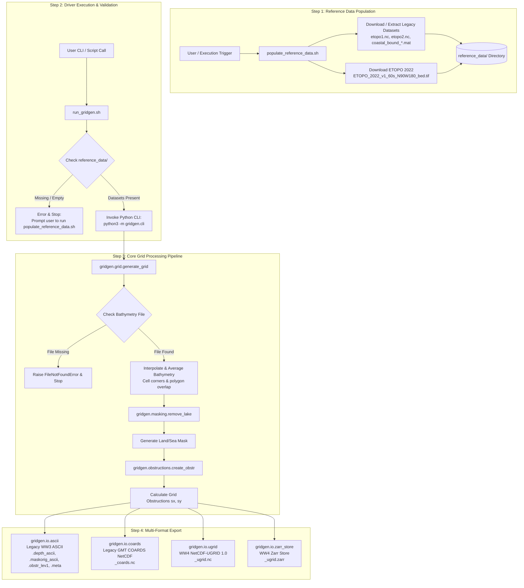

# WAVEWATCH III (WW3) / WAVEWATCH IV (WW4) Gridgen Architecture

This document describes the workflow, data processing steps, and module architecture for the WAVEWATCH III / IV Python Grid Generation Package (`ww4gridgen`).

## Workflow Overview

The grid generation package converts high-resolution source bathymetry and shoreline datasets into structured grid representations used by WAVEWATCH III and WAVEWATCH IV.

## Step-by-Step Processing Pipeline

1. **Reference Data Population (`populate_reference_data.sh`)**
   - Populates bathymetry grids (`etopo1.nc`, `etopo2.nc`, or ETOPO 2022) and shoreline boundary MAT files (`coastal_bound_*.mat`) in `reference_data/`.

2. **Driver Check & Execution (`run_gridgen.sh` & `gridgen.cli`)**
   - Verifies Python dependency availability (`numpy`, `scipy`, `xarray`, `netCDF4`, `zarr`, `shapely`).
   - Ensures `reference_data/` contains bathymetry datasets before invoking `python3 -m gridgen.cli`.

3. **Bathymetry Extraction (`gridgen.grid.generate_grid`)**
   - Computes target grid cell corner polygons (`compute_cellcorner`).
   - Extracts and averages sub-grid base bathymetry depths or performs bilinear interpolation.
   - Assigns dry value (`999999.0`) to cells above cut-off depth.

4. **Masking & Lake Removal (`gridgen.masking`)**
   - Constructs initial binary land/sea mask based on depth values.
   - Cleans disconnected water bodies and applies lake tolerance rules (`remove_lake`).

5. **Sub-grid Obstruction Calculation (`gridgen.obstructions`)**
   - Intersects cell boundary faces with shoreline polygons to produce directional sub-grid obstruction factors `sx` and `sy`.

6. **Multi-Format Grid Export (`gridgen.io.*`)**
   - **Legacy WW3 ASCII:** `.depth_ascii`, `.maskorig_ascii`, `.obstr_lev1`, `.meta`
   - **Legacy GMT/NetCDF COARDS:** `_coards.nc`
   - **WW4 NetCDF-UGRID 1.0:** `_ugrid.nc`
   - **WW4 Zarr Store:** `_ugrid.zarr`
